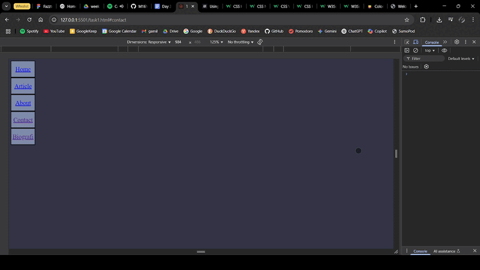
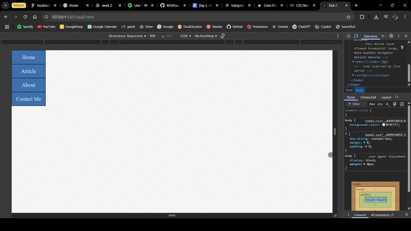
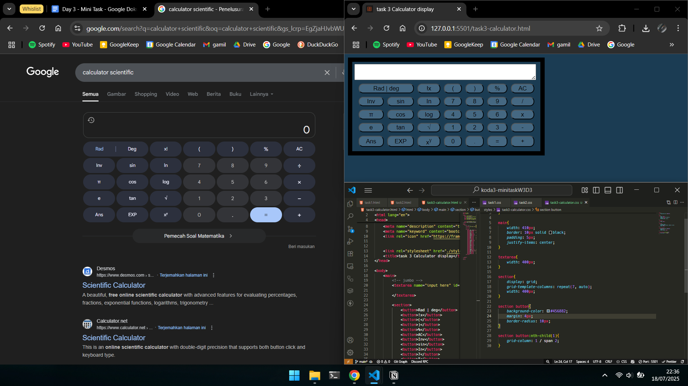

### Minitask week 3 day 3 bootcamp Koda Batch 3

 Details objective task (Click to expands!) 

1. buatlah navbar dengan layouting manual (tanpa flex dengan grid) dengan ketentuan 

- Jika ukuran layar dibawah breakpoint medium, maka bautkan navigator bar mendatar

- Jika ukuran layar dibawah breakpoint large, maka buatkan navigator bar menjadi menurun.

2. Buatlah navbar dengan layout flex dengan kententuan:

- jika ukuran layar dibawah breakpoint medium, maka buatkan navigator bar mendatar

- Jika ukuran layar dibawah breakpoint large, maka bautkan navigator menjadi menurun

3. Buatlah halaman kalkulator online (scientific) dengan menggunakan layout grid

4. Kumpukan di gitbuh dan sertakan file readme yang berisikan preview dari masing-masing halaman.

### Result task number 1 would be like this

### Result task number 2 would be like this

### Result task number 3 would be like this

